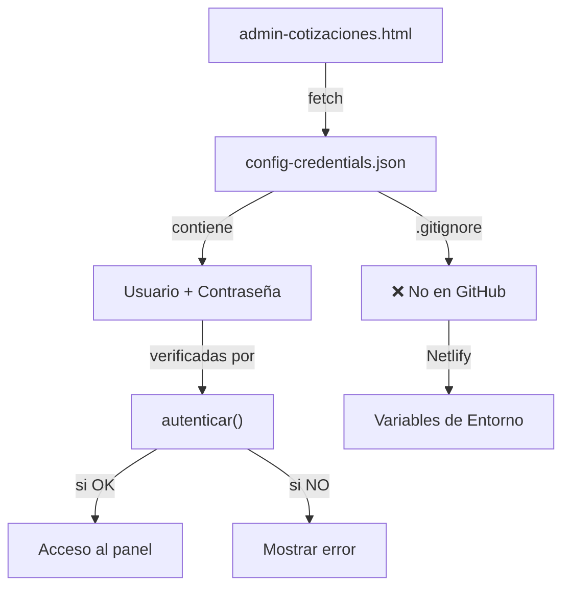

# 🔐 Configuración de Credenciales

## ⚠️ IMPORTANTE: Credenciales No Están en GitHub

Las credenciales del admin panel están excluidas de Git por seguridad. Aquí está cómo configurarlas.

---

## 📋 Estructura de Archivos

```
public/
├── config-credentials.example.json  ✅ En Git (referencia)
├── config-credentials.json          ❌ NO en Git (credenciales reales)
└── config-credentials.local.json    ❌ NO en Git (local override)
```

---

## 🚀 Configuración Local

### 1. Crear el archivo de credenciales
```bash
cp public/config-credentials.example.json public/config-credentials.json
```

### 2. Editar con tus credenciales
```json
{
  "admin": {
    "usuario": "ngk92ortc5",
    "contraseña": "1b7cd9e5feb77e5cce48"
  }
}
```

### 3. Verificar que está en .gitignore
```bash
git status  # config-credentials.json NO debe aparecer
```

---

## 🌐 Configuración en Netlify

### Opción 1: Crear archivo en build
1. Agrega un script `netlify.toml`:
```toml
[build]
  command = "npm run build"
  
[[redirects]]
  from = "/*"
  to = "/index.html"
  status = 200

[build.environment]
  ADMIN_USER = "ngk92ortc5"
  ADMIN_PASS = "1b7cd9e5feb77e5cce48"
```

2. Crea `build.sh`:
```bash
#!/bin/bash
cat > public/config-credentials.json <<EOF
{
  "admin": {
    "usuario": "$ADMIN_USER",
    "contraseña": "$ADMIN_PASS"
  }
}
EOF
```

### Opción 2: Usar Environment Variables de Netlify

1. **Dashboard de Netlify** → Site settings → Build & deploy → Environment
2. Agrega variables:
   - `ADMIN_USER` = tu usuario
   - `ADMIN_PASS` = tu contraseña

3. En tu `netlify.toml`:
```toml
[build.environment]
  ADMIN_USER = "your_username"
  ADMIN_PASS = "your_password"
```

---

## 🔄 Flujo de Seguridad



---

## 📝 Comandos Útiles

### Verificar que las credenciales se cargan
```bash
# Abre DevTools (F12) en admin-cotizaciones.html
# Busca en Console: "✅ Credenciales cargadas desde config-credentials.json"
```

### Generar nuevas credenciales seguras
```bash
node -e "
const crypto = require('crypto');
const u = crypto.randomBytes(8).toString('hex');
const p = crypto.randomBytes(16).toString('hex');
console.log('Usuario:', u);
console.log('Contraseña:', p);
"
```

### Ver si archivo está siendo ignorado
```bash
git check-ignore public/config-credentials.json
# Output: public/config-credentials.json (si está ignorado)
```

---

## 🛡️ Checklist de Seguridad

- [ ] `config-credentials.json` está en `.gitignore`
- [ ] `config-credentials.example.json` tiene valores dummy
- [ ] Credenciales reales nunca se comitean
- [ ] Archivo de credenciales es cargado dinámicamente
- [ ] En Netlify: Environment variables configuradas
- [ ] Console muestra "✅ Credenciales cargadas"

---

## ⚡ Troubleshooting

### "⚠️ No se pudieron cargar credenciales"

**Causa:** El archivo `config-credentials.json` no existe o no es accesible

**Solución:**
```bash
# 1. Crea el archivo
cp public/config-credentials.example.json public/config-credentials.json

# 2. Verifica que se sirve correctamente
curl http://localhost:8000/config-credentials.json

# 3. Reinicia servidor HTTP
```

### Las credenciales no funcionan

**Causa:** Typ o en usuario/contraseña

**Solución:**
```bash
# Verifica en Console del navegador (F12):
# 1. Busca línea: "✅ Credenciales cargadas..."
# 2. Ejecuta: console.log(ADMIN_CREDENTIALS)
# 3. Verifica usuario y contraseña exactamente
```

---

## 🚨 Cambiar Credenciales

### Localmente:
1. Edita `public/config-credentials.json`
2. Guarda (no commites)
3. Recarga página (Cmd+Shift+R)

### En Netlify:
1. Dashboard → Site settings → Build & deploy → Environment
2. Edita `ADMIN_USER` y `ADMIN_PASS`
3. Redeploy el sitio

---

## 📚 Referencias

- [Netlify Environment Variables](https://docs.netlify.com/configure-builds/environment-variables/)
- [.gitignore Documentation](https://git-scm.com/docs/gitignore)
- [Security Best Practices](../SECURITY_IMPLEMENTATION.md)

---

**Last Updated:** 2026-03-17  
**Status:** ✅ Seguro - Credenciales no en GitHub
